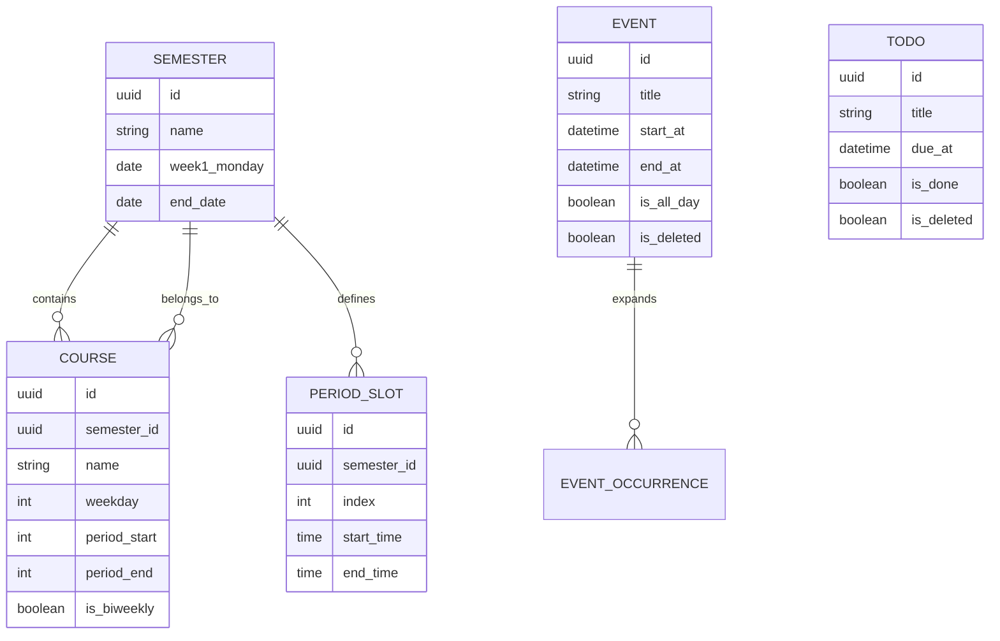

# 日清（RiQing）后续产出物规划

| 项目 | 内容 |
|------|------|
| 文档版本 | v0.1 |
| 基准文档 | `日清_需求文档_修订版.md` |
| 本阶段目标 | **只规划、不展开正文细节** |
| 约束 | 仅 Markdown 文件；不写代码、不建代码文件 |

---

## 一、本阶段范围

### 做什么

1. 明确后续要产出哪些文档
2. 约定每份文档的目录结构、覆盖范围、完成标准
3. 排好依赖顺序与工作量
4. 列出需要你确认的规划级问题

### 不做什么

- 不写 ER 图正式正文、不写完整字段字典
- 不写 Tool 的参数 schema 全文
- 不画可用线框正文
- 不创建 `.json` / `.kt` / `.html` 等任何非 Markdown 文件

---

## 二、产出物总览

| 编号 | 文件名（拟） | 类型 | 依赖 | 优先级 |
|------|----------------|------|------|--------|
| D1 | `01_术语表与概念边界.md` | 词典 / 边界 | 修订版 PRD | P0 |
| D2 | `02_数据模型与ER图.md` | 模型 / ER | D1、PRD §3 | P0 |
| D3 | `03_字段字典.md` | 字段规格 | D2 | P0 |
| D4 | `04_Agent工具契约.md` | 工具与调用约定 | D2、D3 | P0 |
| D5 | `05_核心页面线框.md` | 信息架构 + 线框 | PRD §7、D3 | P0 |
| D6 | `06_时间解析与确认策略.md` | Agent 交互细则 | D4、D5 | P1 |
| D7 | `07_通知与厂商适配检查表.md` | 非功能清单 | PRD §3.1.6、§6 | P1 |
| D8 | `08_MVP验收用例集.md` | 测试 / 验收 | D1–D5 | P1 |

说明：

- **P0**：开工前应齐，缺了会让 Android / Agent 两边对不齐。
- **P1**：可与开发并行，但不建议拖到联调后再补。
- 文件名前缀 `01–08` 仅表示推荐阅读顺序，不是强制版本号。

---

## 三、逐份文档规划

### D1 `01_术语表与概念边界.md`

**目的**：消除「日程 / 事件 / 待办 / 课程 / 实例 / 系列」等同词混用。

**拟包含章节**：

1. 术语表（中英对照 + 一句话定义）
2. 易混概念边界（表格）
3. 本文档集中的统一写法约定

**术语表拟收录（草案，非终稿）**：

| 术语 | 英文 | 草案定义 |
|------|------|----------|
| 日程 / 事件 | Event | 用户创建的、可占时间块的日历条目 |
| 待办 | Todo | 强调完成态与可选截止时间的任务 |
| 课程 | Course | 挂在学期下、按教学周投影到日历的课表条目 |
| 课程实例 | CourseOccurrence | 某一教学周上投影出的一次课（只读投影，非独立表） |
| 教学周 | Teaching Week | 以学期 `week1Monday` 为第 1 周的周序号 |
| 软删除 | Soft Delete | `isDeleted=true`，可撤销 |
| 系列 | Series | 重复规则展开的父事件（MVP 修改仅本次） |
| Agent 工具 | Tool | 模型可调用的本地 CRUD 原子能力 |
| 风险级 | Risk Level | 低 / 中 / 高，决定确认与撤销策略 |

**必须写清的边界**：

- Event ≠ Todo：有无「完成态」
- Course ≠ Event：是否由学期规则投影生成
- 「删除课程」删的是 Course 定义，还是某一教学周的例外？（MVP 建议：只删定义；例外用额外 Event）
- 「今天」= 设备本地日历日

**完成标准**：新人只读本表，能正确回答 5 道边界判断题（规划阶段先出题干，正文阶段再给答案）。

---

### D2 `02_数据模型与ER图.md`

**目的**：给 Room 表设计与 Agent 工具同一套实体真相。

**拟包含章节**：

1. 实体清单与职责
2. ER 图（Markdown 中用 `mermaid erDiagram` 表达）
3. 关系说明（一对多、可选外键、删除策略）
4. 投影规则：某日 Agenda = Events + CourseOccurrences
5. 重复规则展开说明（概念级，不写算法代码）
6. 索引与查询场景清单（按日查、按周查、搜索标题）
7. 明确不建模的内容（参与人、附件、多账号等）

**拟建实体（与 PRD 对齐）**：



上图为**规划示意**，正式稿会补全字段、关系基数与可空性说明。

**关键决策（已写入 PRD，本文件将固定为设计约束）**：

| 决策 | 选择 | 对模型的影响 |
|------|------|----------------|
| 课程与日程 | 分表 + 投影 | 不把 Course 塞进 Event 表 |
| 删除 | 软删除 | 所有可删实体含 `isDeleted` |
| 重复 | MVP 每日/每周/工作日 | Event 可挂 `repeatRule`；课程用周次集合 |
| 例外课 | 不在 Course 上改单周 | 需要例外时建普通 Event，或 V1.1 再引入 Exception 表 |

**待你确认的模型级问题（见 §五）**。

**完成标准**：能从 ER 图回答「删一门课会不会删掉已手改的日程」「某天列表从哪几张表查」。

---

### D3 `03_字段字典.md`

**目的**：把 PRD §3 的字段表扩成开发可直接建表/写校验的规格。

**拟包含章节**：

1. 通用约定（ID 格式、时间类型、时区、软删除、时间戳）
2. 每实体一节：字段表 + 枚举值 + 校验规则 + 索引
3. 字段级隐私分级（本地默认 / 可能进模型上下文）
4. 版本兼容：MVP 必填 vs 可选 vs 预留

**单字段列规划**：

| 列名 | 说明 |
|------|------|
| 字段名 | 驼峰 / snake 均可，正式稿统一一种 |
| 类型 | 逻辑类型（如 DateTime、Enum、List\<Int\>） |
| 必填 | 是/否 |
| 默认值 | |
| 值域/长度 | |
| 校验 | 保存与 Agent 入库前同一套 |
| 索引 | 是否进索引 |
| 说明 | 业务含义 |

**完成标准**：Android 与 Agent 校验规则零口头约定，全以本表为准。

---

### D4 `04_Agent工具契约.md`

**目的**：模型侧 Prompt/Tools 与端侧执行器共用的契约说明。

**拟包含章节**：

1. 工具总表（名称、一句话、风险级、是否写库）
2. 逐工具说明：参数表、成功返回摘要、失败错误码
3. 时间参数规范（ISO-8601 本地、禁止模糊猜测）
4. 确认与撤销矩阵（与 PRD §3.4.4 对齐）
5. 会话内指代约束（MVP 同会话）
6. 不能做的事（拒绝清单）
7. 调用时序（文字流程图 / mermaid sequence，非代码）

**工具总表规划（14 个，与 PRD 一致）**：

| 工具 | 读写 | 风险 |
|------|------|------|
| list_events / list_todos / list_courses / get_semester | 读 | 低 |
| create_event / create_todo / complete_todo | 写 | 低 |
| update_event / update_todo / create_course / update_course | 写 | 中 |
| delete_event / delete_todo / delete_course | 写 | 高 |

**形式约定**：

- 契约用**表格 + 说明**为主
- 如需示例负载，仅以 Markdown 代码围栏内的示意片段出现，**不单独生成 `.json` 文件**
- 错误码用稳定字符串（如 `VALIDATION_ERROR` / `NOT_FOUND`），便于端上映射文案

**完成标准**：不看实现代码也能写出 System Prompt 工具段；测试能按契约造用例。

---

### D5 `05_核心页面线框.md`

**目的**：对齐 MVP 页面信息架构与关键交互，服务视觉/前端，不做高保真。

**拟包含章节**：

1. 全局 IA（底部导航与路由名）
2. 页面清单与优先级
3. 核心页面线框（文本框线 / ASCII，每页：区域、主操作、空态、错误态）
4. 关键组件清单（确认卡片、结果卡片、周切换器、节次网格）
5. 状态机说明：Agent 消息类型（用户 / 思考中 / 确认卡 / 结果卡 / 撤销）

**拟覆盖页面（P0）**：

| 页面 | 线框要点 |
|------|----------|
| 今日 | 日期头、时间轴、待办区、空态 CTA |
| 日历-日 | 时间轴、事件块、悬浮添加 |
| 日历-周 | 七列、教学周、今日高亮 |
| 日历-月 | 密度点、选中日 |
| 课表 | 周网格、第 N 教学周、课程块 |
| Agent | 对话流、确认卡、结果卡、未配置空态 |
| 日程编辑 | 字段序、重复、提醒 |
| 课程编辑 | 学期、周次、节次、单双周 |
| 设置-AI | Endpoint/Key/Model/超时/测试 |
| 设置-提醒引导 | 厂商检查项 |

**形式约束**：

- 只用 Markdown + 纯文本框线
- 不引入图片、不建 HTML、不写 Compose

**完成标准**：评审时能指出「今日页从哪进编辑」「Agent 确认卡有哪些按钮」。

---

### D6 `06_时间解析与确认策略.md`（P1）

**目的**：把中文口语 → 绝对时间 → 确认卡，写成可测策略。

**拟包含章节**：

1. 支持的时间表达白名单（今天/明天/后天/大后天/周X/上午下午晚上/N 点/半…）
2. 不支持或必须反问的表达
3. 解析结果如何写入确认卡（必须绝对时间）
4. 与风险级矩阵的组合示例
5. 测试用例题干清单（规划阶段只列题干，执行阶段再写期望）

---

### D7 `07_通知与厂商适配检查表.md`（P1）

**目的**：保证「提醒」在真机上可交付，而不是实验室功能。

**拟包含章节**：

1. 通知渠道表（与 PRD 一致）
2. 系统权限与精确闹钟状态机
3. 厂商检查表：品牌 → 设置路径 → 验收现象
4. 内测机型优先列表（规划占位，执行时填）

---

### D8 `08_MVP验收用例集.md`（P1）

**目的**：把 PRD DoD 拆成可勾选用例。

**拟包含章节**：

1. 功能用例（Given/When/Then 表格，非代码）
2. Agent 用例（指令原文 → 期望工具 → 期望 UI）
3. 负面用例（无 Key、断网、非法时间、批量删除）
4. 与成功指标的映射

---

## 四、推荐执行顺序

```text
D1 术语表
 └─► D2 ER/数据模型
      └─► D3 字段字典
           └─► D4 Agent 工具契约 ──► D6 时间解析与确认
           └─► D5 页面线框
D2 + PRD ──► D7 通知适配
D3 + D4 + D5 ──► D8 验收用例集
```

**并行建议**：

- 可并行：D1 完成后，D5 线框可与 D2/D3 并行（线框依赖 PRD IA 多于字段细节）
- 不可并行：D4 依赖 D2/D3 的实体与字段名稳定

**建议里程碑**：

| 里程碑 | 完成文档 | 用途 |
|--------|----------|------|
| M1 概念对齐 | D1 | 评审会 15 分钟过术语 |
| M2 数据对齐 | D2 + D3 | Android 建表评审 |
| M3 Agent 对齐 | D4 + D6 | Prompt / 工具联调基线 |
| M4 UI 对齐 | D5 | 视觉与交互开发 |
| M5 可测 | D7 + D8 | 内测与验收 |

---

## 五、规划级待确认问题

以下只影响**规划怎么写**，你点头后我再进入正文阶段。

| # | 问题 | 规划默认 | 若你有不同意见 |
|---|------|----------|----------------|
| Q1 | 课程「某一周调课」MVP 怎么表达？ | 不提供例外表；用额外 Event 标记 | 若要「课表上看得到调课」，需加 Exception 模型，D2 要改 |
| Q2 | 是否存在「多学期并存」？ | 是，可有多条 Semester，课表选当前学期 | 若仅允许一个当前学期，可简化设置页 |
| Q3 | 待办是否允许无标题以外的正文？ | 有 `notes`，与 Event 一致 | 若只要标题，可砍字段 |
| Q4 | Agent 示例负载要不要进 D4？ | 要，但只放在 md 代码围栏里示意 | 若你完全不想要任何代码围栏，可改为纯文字描述参数 |
| Q5 | 线框精度 | 文本框线 + 组件注释 | 若你要「更接近视觉稿」的 ASCII 装饰，工作量会上升 |
| Q6 | 文档放哪 | 均在 `E:\日清\` 根目录，与 PRD 平级 | 若要收进 `docs\` 子目录，规划阶段可定 |

---

## 六、工作量与切分

| 文档 | 预估相对工作量 | 可否单独评审 |
|------|----------------|--------------|
| D1 | 小 | 是 |
| D2 | 中 | 是（依赖 D1） |
| D3 | 中偏大 | 是（依赖 D2） |
| D4 | 中 | 是（依赖 D2/D3） |
| D5 | 中 | 是（依赖 PRD） |
| D6 | 小中 | 是 |
| D7 | 小 | 是 |
| D8 | 中 | 是 |

若你希望**最小可开工集**，建议只锁定：**D1 + D2 + D3 + D4 + D5**（P0）。D6–D8 可第二轮。

---

## 七、本规划的边界与已知问题

| 项 | 说明 |
|----|------|
| 不含视觉系统 | 颜色/字体/组件库不在 D5 线框内，需另开视觉规范 |
| 不含 API 真实实现 | D4 是契约与交互，不是某一厂商 SDK 文档 |
| 不含排期人力 | 只排文档依赖，不估人天 |
| ER 图用 mermaid | 依赖查看器渲染；若环境不渲染，以实体表为准 |
| 中文口语时间 | 白名单永远盖不全，D6 会标「未知表达 → 反问」兜底 |

---

## 八、请你确认后我再动工的事项

1. **是否按 P0 五件套（D1–D5）开始正文？** 还是先只做 D1+D2？
2. **Q1–Q6** 是否接受规划默认？
3. 文件是否平铺在 `E:\日清\`？要不要建 `docs\`？
4. 是否同意：后续正文仍全部为 `.md`，示例仅出现在 Markdown 代码围栏内，不落独立代码文件？

---

*本文件仅为规划。确认前不会写 ER 正文、字段字典全文、工具 schema 全文或线框正文。*
